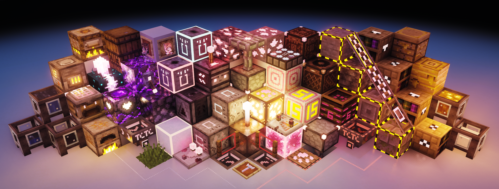

<h1 align = "center">樱喵附加</h1>
<h3 align = "center">TCTC Cherry Addtion</h3>

基于 XeKr 原版红石显示1.17-V1附加

## Introduction / 介绍

简体中文

本纹理包作为 [ XeKr 原版红石显示1.17-V1 ](https://legacy.curseforge.com/minecraft/texture-packs/xekr-redstone-display/files/3344524) 的附加包使用

目前支持的红显内容：1.16.5-1.19.2

目前兼容的游戏版本：1.17-1.20.3

English

This texture pack is used as an add-on pack for [XeKr Redstone Display 1.17-V1](https://legacy.curseforge.com/minecraft/texture-packs/xekr-redstone-display/files/3344524)

Currently supported redstone display content: 1.16.5-1.19.2

Currently compatible game versions: 1.17-1.20.3

### Main Changes / 主要修改内容

简体中文

- 红石元件主颜色修改为樱粉色
- 不死图腾修改为[大白天](https://space.bilibili.com/190067998/)比心玩偶 (腐竹)

English

- Changed the accent color of the redstone component to cherry blossom.
- Totem of the Undying model is changed to a doll, using the TCTC server master's skin.

### Other changes / 其他修改内容

简体中文

- 猫爪风格红石线
- 音符盒锁定显示
- 栅栏门护眼锁定显示
- 粉雪显示
- 堆肥桶新外观
- 阳光探测器新外观
- 漏斗指向纹理简化
- 漏斗、投掷器、发射器锁定显示，需要[XeKr原版红石显示1.17-V2附加包](https://legacy.curseforge.com/minecraft/texture-packs/xekr-redstone-display/files/3504282)
- 烟花火箭区分，需要支持cit的模组
- 黑曜石系列方块新外观
- 猫爪压力板
- 猫爪红石灯
- 兼容[彩虹像素](https://afdian.net/a/Nan2uu)，感谢南烛提供的材质制作指导（使用时请按下列顺序加载：XeKr原版红显1.17-V1置于最底层，其次为彩虹像素v3.2.3+，接着是樱喵附加，最后是XeKr原版红石显示1.17-V2附加包）
- 井字草模型，创意来源于 [BSL mini pack](https://bitslablab.com/bslminipacks/)
- 落沙显示，创意来源于[梧桐加减法](https://afdian.net/a/YSBBBB)，感谢药水棒冰授权兼材质制作指导
- 被闪电击中的避雷针呈白色和铜色渐变
- 粉色选择框着色器实现，感谢火昱Huoyu发布的示例资源包
- 可选原版粉石附加包
- 可选 Emissive 发光纹理附加包（兼轻重质压力板能量等级显示）

English

- Cat claw style redstone wire
- Note block lock display
- Fence gate eye protection lock display
- powder snow display
- Composter new look
- Daylight detectors new look
- Hopper pointing texture simplified
- Locked display of hoppers, droppers, and dispensers. Need [XeKr redstone display 1.17-V2 addition](https://legacy.curseforge.com/minecraft/texture-packs/xekr-redstone-display/files/3504282)
- Firework Rocket Differentiation. Requires a mod that supports CIT
- Obsidian series of blocks new look
- Cat claw pressure plate
- Cat claw redstone lamp
- Compatible with [RainbowPixel](https://afdian.net/a/Nan2uu) (When using, please place it above the XeKr redstone display 1.17-V1, followed by the RainbowPixel v3.2.3+, then the TCTC Cherry addtion, and finally the XeKr redstone display 1.17-V2 addtion)
- Grass model, idea from [BSL mini pack](https://bitslablab.com/bslminipacks/)
- Falling sand display，idea from [梧桐加减法](https://afdian.net/a/YSBBBB)
- Lightning rod struck by lightning now have a white and copper gradient
- Pink selection box shader implementation, thanks to the sample rp poseted by 火昱Huoyu
- Optional original pinkstone add-on pack
- Optional Emissive texture add-on pack (light and heavy pressure plate power level display)

## Mod Requirement / 模组需求

修改红石粉颜色需要自行选择以下模组之一（如果不需要猫爪红石线又不想安装改色模组，可选用原版粉石附加包，可于GitHub Releases页面下载 Minimalist_Style_CherryWire.zip）

To modify the color of redstone wire, you need to choose one of the following mods (If you don’t need the Cat claw style redstone wire and don’t want to install these mods, you can download the Minimalist_Style_CherryWire.zip pack from the GitHub Releases page)

- [OptiFine](https://www.optifine.net/downloads)
- [Colormatic](https://www.curseforge.com/minecraft/mc-mods/colormatic)
- [Vanadium](https://modrinth.com/mod/vanadium)
- [CherryWire](https://github.com/The-Cat-Town-Craft/Cherry-Wire)

发光纹理需要自行选择以下模组之一

Emissive textures require you to choose one of the following mods

- [OptiFine](https://www.optifine.net/downloads)
- [Continuity](https://modrinth.com/mod/continuity)

### Known issues / 已知问题

- 在 Minecraft 1.20+ 版本中使用 0.5.0+ 版本的 Sodium 和 Continuity 一同使用会导致发光纹理和基础纹理产生[深度冲突](https://github.com/PepperCode1/Continuity/issues/292)
- 轻重质压力板能量等级显示不兼容原版渲染，请使用发光纹理附加包且安装 Continuity 或 OptiFine 后使用 ComplementaryReimagined 光影

- light and heavy pressure plate power level display do not compatible with vanilla render, please use the Emissive texture add-on pack and install Continuity or OptiFine to use ComplementaryReimagined Shaders
- Using version 0.5.0+ of Sodium and Continuity in Minecraft versions 1.20+ together will cause [Emissive textures Z-fighting](https://github.com/PepperCode1/Continuity/issues/292).

## Author Information / 作者信息

简体中文

原作者：XeKr

附加作者：Surisen

Xekr 材质 MCBBS 发布页：[链接](https://www.mcbbs.net/thread-823957-1-1.html)

XeKr 原版红石显示1.17-V1：[链接](https://legacy.curseforge.com/minecraft/texture-packs/xekr-redstone-display/files/3344524)

English

Original Author: XeKr

Addon author: Surisen

Xekr RP MCBBS Release Page: [Link](https://www.mcbbs.net/thread-823957-1-1.html)

XeKr redstone display1.17-V1: [Link](https://legacy.curseforge.com/minecraft/texture-packs/xekr-redstone-display/files/3344524)

## LICENSES / 许可协议

简体中文：[CC BY-NC-SA 4.0](https://creativecommons.org/licenses/by-nc-sa/4.0/deed.zh)

English: [CC BY-NC-SA 4.0](https://creativecommons.org/licenses/by-nc-sa/4.0/deed.en)

## Credits / 致谢

简体中文

    Xekr：系列材质教程让我受益匪浅
    Hendrix_Shen: 模组支持
    Capt Tastu：感谢他的创意授权
    药水棒冰：感谢他的创意授权
    南烛：材质创作指导
    火昱Huoyu：选择框改色原版着色器实现授权

English

    Xekr: series of texture pack teaching videos have benefited me a lot
    Hendrix_Shen: mod support
    Capt Tastu: Thanks for his generous authorization
    YSBB: Thanks for his generous authorization
    Nan2uu: creation guidance
    Huoyu：selection box color shader implementation authorization
